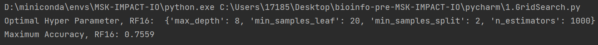

### GridSearch/RandomForestClassifier
这部分主要探究：构造的模型中，哪些因素的影响最大
作者首先按癌症类型将数据集随机分成训练/验证组，训练组有80%的样本(n=1184)、验证组有20%的样本(n=295)
之后作者先选了16个因素，包括癌症类型、Albumin、HED、TMB、FCNA、BMI、NLR、Platelets、HGB、Stage、Age、Drug、Chemo_before_IO、HLA_LOH、MSI、Sex，基于它们使用`GridSearch`方法构建了一个模型`RF16`，之后又用`PermutationImportance`方法评估每个因素对模型的贡献（影响）
{:width=400 height=400}
如图所示，`Weight`就是贡献大小
其中肿瘤突变负荷`TMB`的贡献最大，这与许多其它研究的结果一致；化疗史`Chemo_before_IO`对ICB反应的影响与TMB相似；MSI状态并未被模型选为主要预测因子之一，可能是因为它与TMB密切相关

---

之后作者为了评估将癌症类型、`Chemo_before_IO`以及血液标志物(`Platelets`、`HGB`、`Albumin`)与其他因素相结合的预测能力，又选了11个因素，包括HED、TMB、FCNA、BMI、NLR、Stage、Age、Drug、HLA_LOH、MSI、Sex（注意这里不是上面RF16中影响最大的11个因素），目的是确定以前未广泛使用的其他因素（指影响较小的因素？）来预测ICB
建模方法同上，结果如下
{:width=300 height=300}

---

**两种模型的准确性**：
{:width=150 height=150}
RF16模型的最高准确率为0.7559，RF16模型的最高准确率为0.7576（由于我这里只运行了一次，不一定是最高值）
最后得到两个txt文件(`Test_RF_Prob.txt`和`Training_RF_Prob.txt`)，分别是验证组和训练组中的样本 使用两个模型(RF16/RF11) 预测的得分（对ICB免疫疗法有反应的概率）
{:width=200 height=200}

