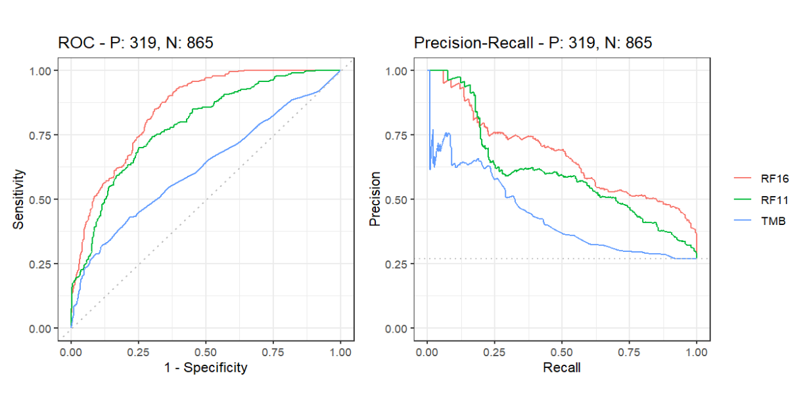

**文章的主要目的**：开发一个机器学习模型，根据各种因素（或者说指标）预测患者是否对ICB治疗有反应（注意不是预测生存时间或者说预后）
### 数据说明
##### 一些概念
**ICB(immune checkpoint blockade)**：免疫检查点阻断
**TMB**：肿瘤突变负荷，指每百万碱基检测出的体细胞变异总数。在多数肿瘤细胞中，TMB越高，产生的新抗原越多，肿瘤免疫原性越高，越容易被免疫细胞识别，从PD-1/PD-L1免疫检查点抑制剂治疗中的获益越显著
**MSI**：微卫星不稳定性，指肿瘤中某个微卫星位点由于重复单元的插入或缺失而出现新的微卫星等位基因的现象。也常用于预测肿瘤预后，绝大多数MSI不稳定性高的患者，TMB都高；但TMB高的，MSI不稳定性不一定高
**生存相关**：
- 总生存时间`os`：从记录开始至（因任何原因）死亡的时间
- 无进展生存期`PFS`：从记录开始到肿瘤发生（任何方面）进展或（因任何原因）死亡的时间。增加了“发生恶化”这一节点，而“发生恶化”往往早于死亡，所以PFS常常短于OS，因而随访时间短一些。PFS的改善包括了“未恶化”和“未死亡”，即间接和直接地反映了临床获益，它取决于新治疗与现治疗的疗效/风险

**逻辑回归模型**(logistic regression model)：根据给定的自变量数据集来估计事件的发生概率，要求因变量是一个二分类变量（即只能取两个值的变量，比如这篇论文中就是“对ICB治疗有/无反应”），结果是事件发生的概率，这篇论文中就是“对ICB治疗有反应的概率”
**ROC曲线**：横轴为FPR（假正例率），指所有负类样本中，被错误预测为正类的比例；纵轴为TPR（真正例率），指所有正类样本中，被正确预测为正类的比例。理想情况下，TPR=1，FPR=0，即图的`(0,1)`点，所以ROC曲线越靠左上角，预测效果越好
- AUC(Area Under Curve)；ROC曲线下的面积，值越大则预测效果越好
  - AUC值接近1：模型预测准确率高
  - AUC值略大于0.5：模型预测准确率一般
  - AUC值小于0.5：模型未达到最低标准，无法使用
- 最优阈值(optimal threshold)：

**PRC曲线**：先看平滑不平滑（越平滑越好），再看谁上谁下（同一测试集、一般情况下，上面的比下面的好）
[更多关于这两种曲线](https://blog.csdn.net/pipisorry/article/details/51788927)
{:width=200 height=200}
如图，红线>绿线>蓝线
**泛癌(pan-cancer)分析**：针对某一个特征横向比较多个癌型，看其敏感性和特异性。其实就是把所有种类（或者说多个种类）的癌症都纳入分析范围
**样本统计指标总结**：
- 真阳性(TP): 模型正确地将正样本预测为正类
- 真阴性(TN): 模型正确地将负样本预测为负类
- 假阳性(FP): 模型错误地将负样本预测为正类
- 假阴性(FN): 模型错误地将正样本预测为负类
- 精确率(Precision): 表示在所有被预测为正类的样本中，实际为正类的比例
- 召回率(Recall): 表示在所有实际为正类的样本中，被正确预测为正类的比例
- 准确率(Accuracy): 表示所有样本中被正确分类的比例

##### R/NR
将接受了PD-1/PD-L1抑制剂、CTLA-4阻断剂或两种免疫疗法的联合治疗的患者分为不同组：
- 出现完全应答complete response(CR)或部分应答partial response(PR)的患者——**应答者responders(R)**
- 疾病无变化stable disease(SD)或发生进展progressive disease(PD)的患者——**非应答者non-responders(NR)**
##### 源数据各列含义
| 列名                                                 | 含义                                | 补充                                    |
| ---------------------------------------------------- | ----------------------------------- | --------------------------------------- |
| SAMPLE_ID                                            | 样本编号                            |                                         |
| Cancer_type_grouped_2 Cancer_Type2 Cancer_Type | 癌症类型                            |                                         |
| Chemo_before_IO                                      | 患者在免疫治疗前是否接受化疗        | 1接受 0没接受                        |
| Age                                                  | 年龄                                |                                         |
| Sex                                                  | 性别                                | 1男性 0女性                          |
| BMI                                                  | 体重指数                            |                                         |
| Stage                                                | 肿瘤分期                            | 1表示IV期 0表示I-III期               |
| Stage at IO start                                    | 患者在免疫治疗前的肿瘤分期          |                                         |
| NLR                                                  | 血液中性粒细胞与淋巴细胞比值        |                                         |
| Platelets                                            | 血小板水平                          |                                         |
| HGB                                                  | 血红蛋白水平                        |                                         |
| Albumin                                              | 白蛋白水平                          |                                         |
| Drug                                                 | 使用的免疫治疗药物                  | 0使用PD1/PDL1或CTLA4 1同时使用这两种 |
| Drug_class                                           | 使用的免疫治疗药物名称              |                                         |
| TMB                                                  | 肿瘤突变负荷                        |                                         |
| FCNA                                                 | 拷贝数改变分数                      |                                         |
| HED                                                  | HLA-I的进化差异                     |                                         |
| HLA_LOH                                              | HLA-I杂合性缺失状态                 |                                         |
| MSI                                                  | 微卫星不稳定性                      | 1不稳定 0稳定/不确定                 |
| MSI_SCORE                                            | 微卫星不稳定性得分                  |                                         |
| Response                                             | 是否有应答                          | 1应答者 0非应答者                    |
| OS_Event                                             | 是否死亡                            | 1死亡 0存活                          |
| OS_Months                                            | 总生存时间                          | 以月为单位                              |
| PFS_Event                                            | 是否死亡/肿瘤是否发生恶化           | 1发生 0没发生                        |
| PFS_Months                                           | 无进展生存期                        | 以月为单位                              |
| RF16_prob RF11_prob                               | 不属于源数据，是通过sklearn得到的值 |                                         |

### 算法分析
在[方法](https://www.nature.com/articles/s41587-021-01070-8#Sec2)一栏中，其中`Patient data description`、`Response, OS and PFS`、`Genomic, demographic, molecular and clinical data`都是在说源数据是怎么来的，以及数据的划分、处理方法、具体含义等等
##### Model description

##### Logistic regression analysis

##### ROC and precision-recall curve analyses

##### Statistical analyses
